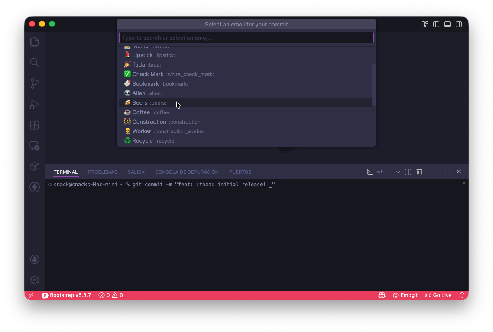

# Emogit

  

> Inserta emojis en el terminal integrado de VS Code con un clic. Los emojis quedan visibles y válidos en los commits de Git.

Contenido: [Características](#-características) • [Instalación](#-instalación) • [Uso](#-uso) • [Tabla de emojis](#-tabla-de-emojis) • [Requisitos](#-requisitos) • [Soporte y autor](#-soporte-y-autor)

---

## ✨ Características

- **Selector en la barra de estado**: Selector con el texto `Emogit` aparece en la barra inferior.
- **Quick Pick**: Al hacer clic se abre un selector rápido con los emojis disponibles.
- **Inserción inmediata**: Al seleccionar un emoji se escribe el carácter en el terminal integrado.
- **Foco en terminal**: Después de insertar el emoji el foco se establece en el terminal para continuar escribiendo o ejecutar el commit.
- **Compatibilidad con commits**: Los emojis insertados son parte de la convención `Gitmoji` válidos en los commit de Git.

## 📸 Screenshot




## 🚀 Instalación

### Desde el Marketplace de VS Code

1. Abre VS Code
2. Ve a Extensiones (`Ctrl+Shift+X` o `Cmd+Shift+X` en macOS)
3. Busca **Emogit** y haz clic en **Instalar**

O instala desde la línea de comandos:

```bash
code --install-extension orvek.emogit
```

### Desde el código (desarrollo)

1. Clona este repositorio
2. Abre la carpeta en VS Code
3. Ejecuta:

```bash
npm install
```

4. Presiona `F5` para abrir una ventana de "Extension Development Host" y probar la extensión
5. (Opcional) Para empaquetar:

```bash
# instala vsce si no lo tienes
npm install -g vsce
vsce package
```

## 📝 Uso

Después de instalar Emogit verás un ícono de smile en la barra de estado con el texto `Emogit`.

Flujo de uso:

1. Haz clic en el ícono `Emogit` en la barra de estado.
2. Se abre un `QuickPick` con la lista de emojis.
3. Haz clic en el emoji deseado.
4. El emoji se escribe en el terminal integrado y el foco se sitúa en él.

## 🔢 Tabla de emojis

Usa los siguientes emojis según el tipo de commit de [Conventional Commits](https://www.conventionalcommits.org/) o [Angular](https://github.com/angular/angular/blob/master/CONTRIBUTING.md#commit):

| Emoji | Código | Tipo de commit | Descripción |
|:-----:|:------:|:---------------:|------------|
| ⚡    | `:zap:` | `perf` | Mejoras de rendimiento |
| 🐛    | `:bug:` | `fix` | Corrección de bugs |
| ✨    | `:sparkles:` | `feat` | Nueva característica |
| 🚀    | `:rocket:` | `release` | Lanzamiento / versión |
| 📝    | `:memo:` | `docs` | Documentación |
| 💄    | `:lipstick:` | `style` | Estilos (formato, sangría) |
| 🎉    | `:tada:` | `feat` | Celebración / feature importante |
| ✅    | `:white_check_mark:` | `test` | Pruebas unitarias |
| 🔖    | `:bookmark:` | `release` | Marcador de versión |
| 👽    | `:alien:` | `chore` | Cambios por compatibilidad |
| 🍻    | `:beers:` | `chore` | Cambios casuales / sociales |
| ☕    | `:coffee:` | `chore` | Pequeño ajuste |
| 🚧    | `:construction:` | `wip` | Trabajo en progreso |
| 👷    | `:construction_worker:` | `ci` | Configuración de CI/CD |
| ♻️    | `:recycle:` | `refactor` | Refactorización |
| ⏪    | `:rewind:` | `revert` | Revertir commit anterior |
| 📦    | `:package:` | `chore` | Actualización de dependencias |
| 💥    | `:boom:` | `breaking` | Cambio que rompe compatibilidad |
| 🏷️    | `:label:` | `release` | Etiqueta / versión |
| 💼    | `:briefcase:` | `business` | Cambio de negocio |
| 🏗️    | `:building_construction:` | `refactor` | Cambio estructural |
| 💩    | `:poop:` | `wip` | Código temporal / pendiente |
| 🔀    | `:twisted_rightwards_arrows:` | `merge` | Merge de ramas |
| ⚰️    | `:coffin:` | `remove` | Eliminar código / features |

## 💡 Ejemplos de uso

Ejemplos de commits usando Emogit en los commits cuando son insertados y luego se suben al repositorio:

```bash
# git commit -m "feat: 🎉 initial release! 🍻"
git commit -m "feat: :tada: initial release! :beers:"

# git commit -m "chore: 📦 setup eslint and prettier"
git commit -m "chore: :package: setup eslint and prettier"

# git commit -m "fix: 🐛 critical bug fix after coffee"
git commit -m "fix: :bug: critical bug fix after coffee"
```

## ⚙️ Requisitos

- Visual Studio Code (recomendado: versión estable más reciente)
- Git (para usar emojis en mensajes de commit y verlos en el historial)
- Node.js y `npm` (solo necesarios para desarrollo/despliegue desde el código fuente)

## 🛠️ Desarrollo y pruebas (opcional)

Prerequisitos para desarrollo:

- Node.js >= 20
- `npm` o `pnpm` si prefieres

Comandos comunes:

```bash
npm install
npm run watch    # si existe script watch
npm test         # ejecuta tests de extensión (requiere host de VS Code)
```

Para probar la extensión, abre el proyecto en VS Code y presiona `F5`.

## 🆘 Soporte y autor

Si encuentras problemas o tienes sugerencias, abre un issue en el repositorio.

- **Autor**: Jhoel Cordova — https://github.com/orvek

## 📜 Licencia

Este proyecto está bajo la licencia MIT. Consulta el archivo [LICENSE](LICENSE) para más detalles.

---

Hecho con cariño ❤️
