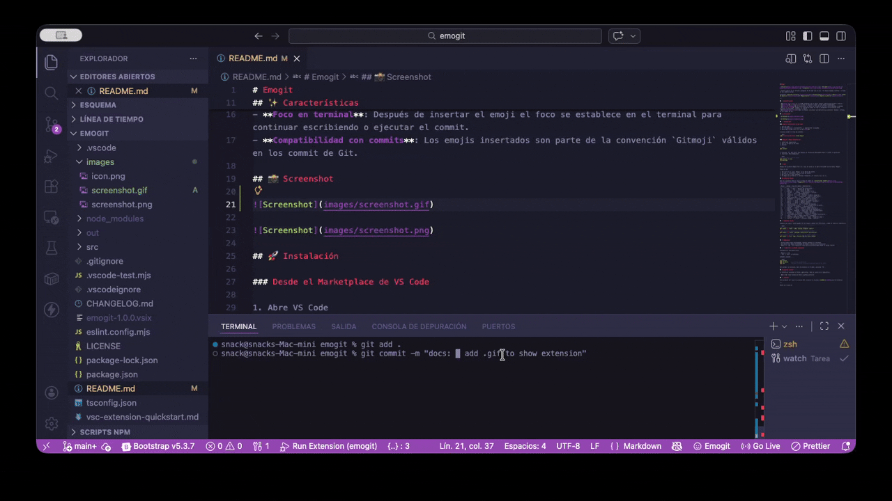
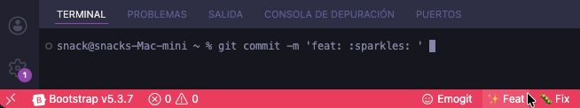
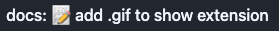

# Emogit

  

> Insert emojis in the VS Code integrated terminal with one click. The emojis remain visible and valid in Git commits.

Contents: [Features](#-features) • [Installation](#-installation) • [Usage](#-usage) • [Emoji Table](#-emoji-table) • [Requirements](#-requirements) • [Support and Author](#-support-and-author)

---

## ✨ Features

- **Status Bar Selector**: A selector with the text `Emogit` appears in the bottom bar.
- **Quick Pick**: Clicking opens a quick selector with available emojis.
- **Instant Insertion**: When you select an emoji, the character is written to the integrated terminal.
- **Terminal Focus**: After inserting the emoji, focus is set to the terminal so you can continue typing or execute the commit.
- **Commit Compatibility**: The inserted emojis are part of the `Gitmoji` convention and are valid in Git commits.

## 📸 Screenshots





## 📸 Result


## 🚀 Installation

### From VS Code Marketplace

1. Open VS Code
2. Go to Extensions (`Ctrl+Shift+X` or `Cmd+Shift+X` on macOS)
3. Search for **Emogit** and click **Install**

Or install from the command line:

```bash
code --install-extension orvek.emogit
```

### From Source Code (Development)

1. Clone this repository
2. Open the folder in VS Code
3. Run:

```bash
npm install
```

4. Press `F5` to open an "Extension Development Host" window and test the extension
5. (Optional) To package:

```bash
# install vsce if you don't have it
npm install -g vsce
vsce package
```

## 📝 Usage

After installing Emogit, you'll see a smiley icon in the status bar with the text `Emogit`.

Usage flow:

1. Click the `Emogit` icon in the status bar.
2. A `QuickPick` with the list of emojis opens.
3. Click on the desired emoji.
4. The emoji is written to the integrated terminal and the focus is placed on it.

## 🔢 Emoji Table

Use the following emojis according to the commit type from [Conventional Commits](https://www.conventionalcommits.org/) or [Angular](https://github.com/angular/angular/blob/master/CONTRIBUTING.md#commit):

| Emoji | Code | Commit Type | Description |
|:-----:|:------:|:---------------:|------------|
| ⚡    | `:zap:` | `perf` | Performance improvements |
| 🐛    | `:bug:` | `fix` | Bug fix |
| ✨    | `:sparkles:` | `feat` | New feature |
| 🚀    | `:rocket:` | `release` | Release / version |
| 📝    | `:memo:` | `docs` | Documentation |
| 💄    | `:lipstick:` | `style` | Styles (formatting, indentation) |
| 🎉    | `:tada:` | `feat` | Celebration / important feature |
| ✅    | `:white_check_mark:` | `test` | Unit tests |
| 🔖    | `:bookmark:` | `release` | Version marker |
| 👽    | `:alien:` | `chore` | Compatibility changes |
| 🍻    | `:beers:` | `chore` | Casual / social changes |
| ☕    | `:coffee:` | `chore` | Minor adjustment |
| 🚧    | `:construction:` | `wip` | Work in progress |
| 👷    | `:construction_worker:` | `ci` | CI/CD configuration |
| ♻️    | `:recycle:` | `refactor` | Refactoring |
| ⏪    | `:rewind:` | `revert` | Revert previous commit |
| 📦    | `:package:` | `chore` | Dependency update |
| 💥    | `:boom:` | `breaking` | Breaking change |
| 🏷️    | `:label:` | `release` | Tag / version |
| 💼    | `:briefcase:` | `business` | Business change |
| 🏗️    | `:building_construction:` | `refactor` | Structural change |
| 💩    | `:poop:` | `wip` | Temporary / pending code |
| 🔀    | `:twisted_rightwards_arrows:` | `merge` | Branch merge |
| ⚰️    | `:coffin:` | `remove` | Remove code / features |

## 💡 Usage Examples

Examples of commits using Emogit when emojis are inserted and then pushed to the repository:

```bash
# git commit -m "feat: 🎉 initial release! 🍻"
git commit -m "feat: :tada: initial release! :beers:"

# git commit -m "chore: 📦 setup eslint and prettier"
git commit -m "chore: :package: setup eslint and prettier"

# git commit -m "fix: 🐛 critical bug fix after coffee"
git commit -m "fix: :bug: critical bug fix after coffee"
```

## ⚙️ Requirements

- Visual Studio Code (recommended: latest stable version)
- Git (to use emojis in commit messages and see them in the history)
- Node.js and `npm` (only needed for development/deployment from source code)

## 🛠️ Development and Testing (Optional)

Prerequisites for development:

- Node.js >= 20
- `npm` or `pnpm` if you prefer

Common commands:

```bash
npm install
npm run watch    # if the watch script exists
npm test         # runs extension tests (requires VS Code host)
```

To test the extension, open the project in VS Code and press `F5`.

## 🆘 Support and Author

If you encounter issues or have suggestions, open an issue on the repository.

- **Author**: Jhoel Cordova — https://github.com/orvek

## 📜 License

This project is under the MIT license. See the [LICENSE](LICENSE) file for more details.

---

Made with love ❤️
